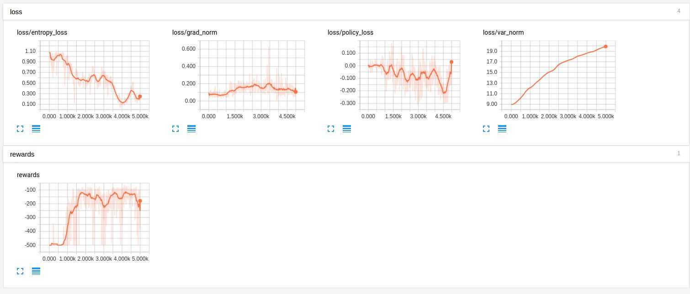

# Policy Gradient with Recurrent Neural Network (RNN) 
Modular implementation of Vanila Policy Gradient (VPG) algorithm with an RNN policy.

# Dependencies
* Python 2.7 or 3.5
* [TensorFlow](https://www.tensorflow.org/) 1.10
* [gym](https://pypi.python.org/pypi/gym) 
* [numpy](https://pypi.python.org/pypi/numpy)
* [tqdm](https://pypi.python.org/pypi/tqdm) progress-bar

# Features
- Using an RNN policy for giving the action probabilities for a reinforcement learning problem
- Using a sampler that reshape the trajectory to be feed into an RNN policy
- Using gradient clipping to solve the exploding gradient problem
- Using GRU to solve the vanishing gradient problem  

# Usage

To train a model for Cartpole-v0:

	$ python run_pg_rnn.py 

To view the tensorboard

	$tensorboard --logdir .

# Results

- Tensorboard Progress Bar

